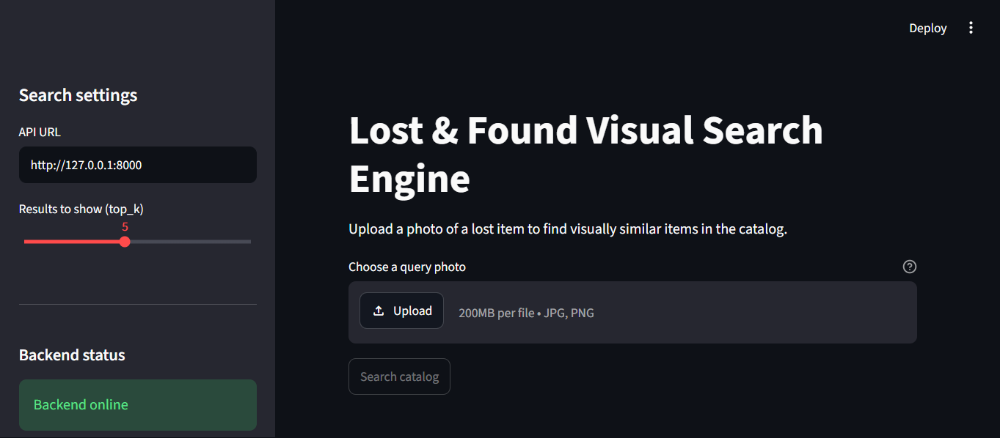

# Lost & Found Visual Search Engine

This project finds catalog images visually similar to an uploaded query image using CLIP embeddings, FAISS, a FastAPI backend, and a Streamlit frontend.

## Prerequisites

- Python 3.11 or compatible
- A project virtual environment in `venv`
- Catalog images in `data/catalog` (`.jpg`, `.jpeg`, or `.png`)

Install the frontend dependencies in Windows CMD:

```cmd
cd /d "C:\Users\koira\lost_and_found_engine"
venv\Scripts\activate.bat
python -m pip install streamlit requests
```

The backend also requires FastAPI, Uvicorn, Sentence Transformers, Pillow, PyTorch, NumPy, and FAISS CPU. If they are not installed in the virtual environment, install them with:

```cmd
python -m pip install fastapi uvicorn sentence-transformers pillow torch numpy faiss-cpu
```

## Prepare the image index

Run this after adding or replacing catalog images. It creates `data/embeddings.npy` and `data/image_paths.npy`, which the backend loads at startup.

```cmd
python extract_embeddings.py
```

## Run the application

Open two Windows CMD terminals in the project directory and activate the virtual environment in each.

**Terminal 1 — FastAPI backend:**

```cmd
cd /d "C:\Users\koira\lost_and_found_engine"
venv\Scripts\activate.bat
python -m uvicorn main:app --reload --host 127.0.0.1 --port 8000
```

**Terminal 2 — Streamlit frontend:**

```cmd
cd /d "C:\Users\koira\lost_and_found_engine"
venv\Scripts\activate.bat
python -m streamlit run ui.py
```

Open the Streamlit URL printed in the second terminal (normally `http://localhost:8501`). The sidebar checks the backend at `http://127.0.0.1:8000/` and lets you change the API URL and result count. Upload a JPG, JPEG, or PNG and select **Search catalog** to see the closest matches.

The search endpoint returns catalog paths. The Streamlit app displays a matched image when that path exists within the local project directory; otherwise, it still shows the path and similarity score.

## API contract used by the frontend

- `GET /` — health status and indexed catalog item count.
- `POST /search?top_k=5` — multipart upload with a `file` field; returns `query_status`, `total_results`, and `matches` containing `image_path` and `similarity_score`.
